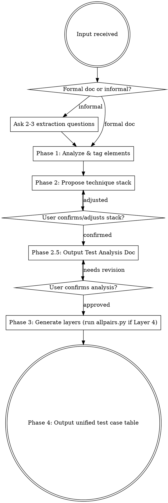

# Test Case Designer

## Overview

Design high-quality software test cases by systematically analyzing requirement documents or module descriptions, applying a layered combination of proven techniques, and producing two structured deliverables:

1. **`{ModuleName}-test-analysis.md`** — Test Analysis Document (reviewed and approved before any cases are written)
2. **`{ModuleName}-test-cases.md`** — 10-column unified test case table

**Two activation modes:**
- **Autonomous**: user provides a formal requirements document → run full pipeline with minimal interaction
- **Interactive**: user describes a module informally → ask 2-3 targeted extraction questions first

**REQUIRED REFERENCE:** Read `technique-reference.md` (located in the same directory as this SKILL.md file) when constructing technique-specific artifacts (equivalence class tables, decision tables, orthogonal arrays, state diagrams).

---

## Accepted Input

| Input Type | Description |
|---|---|
| Requirements document | PRD, BRD, user stories, feature specs in text or Markdown |
| Module description | Informal spoken/written description — e.g. "login module", "checkout flow" |

---

## 5-Phase Pipeline



---

### Phase 1: Analyze & Tag

Read the input and tag each element with the technique(s) it triggers:

| Element Found | Triggers |
|---|---|
| User flows / business processes | Layer 1 (Scenario) + Layer 5 (Workflow) |
| Input fields (text, number, date, dropdown, checkbox) | Layer 2 (Equivalence + Boundary) |
| Conditional logic (if/else, AND/OR, nested rules) | Layer 3 (Decision Table) |
| 3+ parameters each with 2+ values | Layer 4 (Orthogonal Array) |
| State transitions (pending → approved → rejected) | Layer 5 (Workflow/State) |

**For informal input only:** Ask these questions before tagging (one at a time, stop when enough to proceed):
1. "What input fields does this form/feature have?"
2. "Are there any special business rules or conditions?"
3. "Does this feature have status or state changes?"

---

### Phase 2: Propose Technique Stack

Present the proposed stack in this format and wait for confirmation:

> "Based on the analysis, I suggest applying:
> **Scenario (Layer 1) → Equivalence + Boundary (Layer 2) → Decision Table (Layer 3) → Error Guessing (Layer 6)**
> Layers 4 and 5 are skipped — no multi-parameter combinations or state transitions detected.
> Confirm or adjust?"

**User responses:**
- `"confirm"` / `"yes"` / `"ok"` → proceed
- Remove a layer (e.g. `"skip orthogonal"`) → remove and re-propose
- Add a layer (e.g. `"also add workflow"`) → add and re-propose
- Custom list → adopt exactly, no argument

---

### Phase 2.5: Test Analysis Document (Mandatory Review Gate)

Output `{ModuleName}-test-analysis.md` containing all applicable sections below. **Do NOT proceed to Phase 3 until user explicitly approves.**

**Always-present sections:**
1. **Module Overview** — functional summary and core business objective
2. **Test Scope Statement** — In Scope list + Out of Scope list
3. **Test Risk Assessment** — each sub-feature/field rated 🔴 High / 🟡 Medium / 🟢 Low with reason
4. **Coverage Targets** — e.g. "P1: 100%, P2: ≥80%, P3: discretionary"
10. **Error Guessing Analysis** — defect-prone areas sorted by risk (see `technique-reference.md` checklist)
11. **Requirement Traceability Matrix (RTM)** — requirements IDs listed; Test Case ID column left blank (backfilled after Phase 4)

**Conditional sections (include only if the corresponding layer is selected):**

| Section | Include when |
|---|---|
| 5. Scenario Analysis | Layer 1 selected |
| 6. Equivalence & Boundary Analysis | Layer 2 selected — use table format from `technique-reference.md` |
| 7. Decision Table Analysis | Layer 3 selected — use template from `technique-reference.md` |
| 8. Orthogonal Analysis | Layer 4 selected — show factor-level table, then run `allpairs.py` and include output |
| 9. State Transition Analysis | Layer 5 selected — use Mermaid `stateDiagram-v2` format |

**Review gate rules:**
- Output the full document, then pause with: `"Analysis document complete. Please review and approve, or point out any gaps."`
- If user identifies gaps → supplement and re-output the updated document
- Only proceed to Phase 3 when user replies with `"approved"` / `"ok"` / `"analysis complete, start generating"`

**If Layer 4 is selected:** Before running `allpairs.py`, verify Python is available:
```bash
python --version
```
If Python is not found: output `"⚠️ Python environment not found. Please ensure Python 3 is installed and retry."` and stop.

Note: On Windows, `python` may not work — try `py` or the full path to python.exe.

---

### Phase 3: Generate Layers

Apply layers in this fixed order. Skip conditional layers if not in the confirmed stack.

| Layer | Technique | Condition | Rule |
|---|---|---|---|
| 1 | Scenario-based | Always | Main success path + alternate paths + exception paths. Mark main success path rows `Smoke ✓` |
| 2 | Equivalence + Boundary | Always | Per field: valid class + invalid classes + 6 boundary points (min−1, min, min+1, max−1, max, max+1) |
| 3 | Decision Table | If 2+ interdependent conditions | All condition combinations; collapse equivalent-outcome columns |
| 4 | Orthogonal Array | If 3+ params × 2+ values | Run `allpairs.py`; use output rows directly as test cases |
| 5 | Workflow / State | If state transitions exist | Valid transitions + invalid transitions + skip-step attempts |
| 6 | Error Guessing | Always | Apply checklist from `technique-reference.md` Error Guessing section |

**Risk-driven case density** (from Phase 2.5 Risk Assessment):

| Risk | P1 cases | P2 cases | P3 cases |
|---|---|---|---|
| 🔴 High | ≥3 | ≥2 | discretionary |
| 🟡 Medium | ≥2 | ≥1 | discretionary |
| 🟢 Low | ≥1 | discretionary | may omit |

**Calling allpairs.py (Layer 4 only):**
```bash
# Run from the skill's directory, or adjust path to where SKILL.md is located
python ./scripts/allpairs.py \
  --input '{"parameters": {"param1": ["v1","v2"], "param2": ["v1","v2","v3"]}}'
```
Use the printed Markdown rows as test case rows. Set `Technique` = `Orthogonal`, IDs continue global sequence.

---

### Phase 4: Output Unified Table

Merge all generated rows into a single Markdown table saved as `{ModuleName}-test-cases.md`.

After saving, backfill the RTM in `{ModuleName}-test-analysis.md` — add the generated TC-xxx IDs to the Test Case IDs column.

---

## Output Format: 10-Column Test Case Table

| ID | Technique | Test Level | Test Scenario | Preconditions | Steps | Expected Result | Priority | Smoke | Requirement Ref |
|---|---|---|---|---|---|---|---|---|---|
| TC-001 | Scenario | UI | Valid login with correct credentials | Account exists, not locked | 1. Navigate to /login 2. Enter valid username 3. Enter valid password 4. Click Login | Redirect to /dashboard; session cookie set | P1 | ✓ | REQ-001 |
| TC-002 | Scenario | UI | Login with incorrect password | Account exists, not locked | 1. Navigate to /login 2. Enter valid username 3. Enter wrong password 4. Click Login | Error message shown; remain on /login | P1 | | REQ-002 |

**Column rules:**

| Column | Rule |
|---|---|
| `ID` | `TC-001` sequential across all layers, never reset between layers |
| `Technique` | Exact value: `Scenario` / `Equivalence` / `Boundary` / `Decision Table` / `Orthogonal` / `Workflow` / `Error Guessing` |
| `Test Level` | `UI` / `API` / `DB` / `Logic` — multiple allowed separated by `/` (e.g. `UI/DB`) |
| `Test Scenario` | One sentence, describes what is being tested |
| `Preconditions` | Required system state before executing this case |
| `Steps` | Numbered inline: `1. Do X 2. Do Y 3. Do Z` |
| `Expected Result` | Observable system response |
| `Priority` | `P1` / `P2` / `P3` — see risk-driven density table above |
| `Smoke` | `✓` for Layer 1 main success path cases only; blank otherwise |
| `Requirement Ref` | `REQ-001` auto-generated if not in source doc; comma-separated if multiple |

**Requirement Ref auto-generation:** If the source document has no requirement IDs, assign `REQ-001`, `REQ-002`, etc. sequentially based on the requirement points extracted in Phase 2.5 RTM.

## Common Mistakes

| Mistake | Correct behavior |
|---|---|
| Skipping Phase 2.5 and generating cases immediately after stack confirmation | Always output the Test Analysis Document first; never generate cases without user approval of the analysis |
| Applying Layer 4 (Orthogonal) when there are only 2 parameters | Use full Cartesian product for 1–2 parameters; Orthogonal only for 3+ parameters |
| Marking multiple cases as `Smoke ✓` across different layers | Smoke flag is ONLY for Layer 1 main success path cases; max 1–3 per module |
| Resetting TC-xxx numbering between layers | IDs are global and sequential across the entire table — never restart at TC-001 for a new layer |
| Running allpairs.py without checking Python availability | Always run `python --version` first; on failure output the ⚠️ message and stop |
| Proceeding to Phase 3 when user identifies gaps in the analysis | Re-output the updated analysis document; wait for explicit approval again |
| Generating all test cases without consulting risk density rules | Check Phase 2.5 Risk Assessment before deciding how many P1/P2/P3 cases to generate per area |
| Leaving `Requirement Ref` blank because source doc has no IDs | Auto-generate `REQ-001`, `REQ-002` etc. from the RTM built in Phase 2.5 |
| Leaving RTM Test Case ID column blank in the final deliverable | Backfill RTM with TC-xxx IDs after Phase 4 table is complete |
