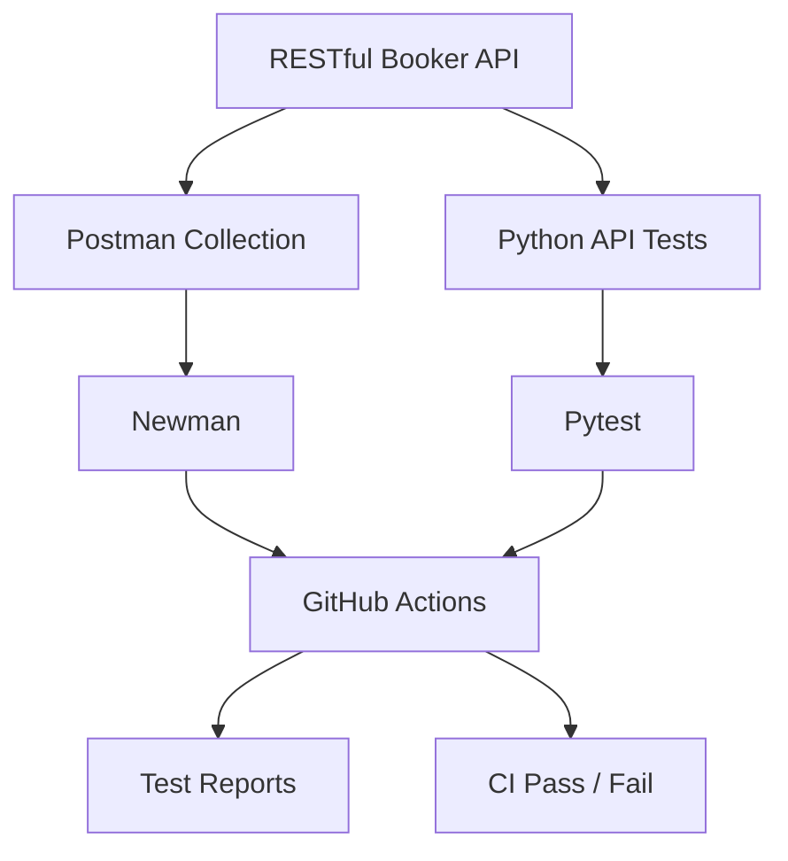

# Production-Grade REST API Testing Framework — RESTful Booker

[](https://github.com/alaa-shehata5/testing2/actions/workflows/api-tests.yml)
[](https://github.com/alaa-shehata5/testing2/actions/workflows/postman-tests.yml)

> Only CI badges — no decorative shields. Proof lives in
> [`docs/evidence/`](docs/evidence/) (real run transcripts), not in icons.

Professional API QA automation against the public
[RESTful Booker API](https://restful-booker.herokuapp.com/apidoc/index.html),
covering functional, negative, boundary, contract/schema, authentication, and
end-to-end workflow testing in **two harnesses — Postman/Newman and Python
(pytest + requests + jsonschema)** — both gated in **GitHub Actions**.

> Verified 2026-10-04: **pytest 49 passed / 0 failed**; **Newman 57 requests /
> 215 assertions / 0 failed**. Every number in this README was observed in a
> real run — nothing is projected or fabricated.

## Technologies

| Layer | Tools |
| --- | --- |
| API test design | Postman (8-folder collection), JSON Schema (draft-07) |
| CLI execution | Newman 6 (`npm ci` pinned) |
| Code automation | Python 3.12+, pytest, requests, jsonschema, pytest-html |
| CI/CD | GitHub Actions (pytest + Newman, push / PR / manual dispatch) |
| Docs | Markdown + Mermaid (`docs/`) |

## What was tested

- **Health** — `GET`/`HEAD /ping` (including the observed `201`, not 200)
- **Authentication** — `POST /auth`: valid token issue, 4 failure modes
  (wrong password / unknown user / empty body / empty strings → `200` +
  `{"reason":"Bad credentials"}`), cookie-token and Basic-auth writes,
  missing/invalid-token `403` on every write method
- **CRUD** — create (with create→GET round-trip integrity), retrieve,
  full replace (`PUT`), partial update (`PATCH`), delete (with verify-gone)
- **Listing/filtering** — ID-array shape, `firstname`/`lastname`/date-window/
  combined filters (shape-only; shared host is volatile)
- **Negative cases** — missing fields (`500`), type coercion
  (`totalprice→null`, `depositpaid→true`, bad date→`"0NaN-aN-aN"`),
  malformed JSON (`400`), bad `Content-Type` (`500`), nonexistent/malformed/
  huge IDs (`404`), re-delete (`405`), empty/unknown/null extras
- **Boundary cases** — price `0` / `-50` / `999999999`, inverted date range,
  500-char names, very large IDs
- **Schema validation** — auth, booking, create-response, and list contracts
  asserted in both harnesses (4 schemas each side)
- **Data integrity** — every create/update/patch test re-fetches and compares
- **End-to-end workflows** — full lifecycle
  auth → create → get → put → get → patch → delete → verify-gone on token
  auth **and** on Basic auth (Postman folder 08)

## Automation (how it runs)

```text
Postman collection → Newman CLI → postman-tests.yml (CI)
Python tests      → pytest       → api-tests.yml (CI)
```

Both workflows fail closed: any test, install, or artifact failure fails the
job (no `continue-on-error`; only uploads use `if: always()`). JUnit +
HTML reports upload as artifacts on every run.

## Repository structure

```text
.
├── docs/                  # strategy, plan, scenarios (56), test-data,
│                          # api-inventory, defect-summary, traceability-matrix,
│                          # newman guide, architecture
├── postman/
│   ├── collections/       # restful-booker-api.postman_collection.json (57 requests)
│   ├── environments/      # restful-booker.postman_environment.json
│   └── schemas/           # auth / booking / booking-response / booking-list
├── tests/
│   ├── api/               # 8 pytest modules (health, auth, CRUD, negative, headers)
│   └── schemas/           # same 4 contracts for Python validation
├── src/                   # api_client.py, config.py, test_data.py
├── scripts/               # run_tests.sh, run_postman.sh
├── .github/workflows/    # api-tests.yml, postman-tests.yml
├── reports/               # generated artifacts (git-ignored)
├── requirements.txt / package.json / pytest.ini / .env.example
└── LICENSE
```

## How to run

Requirements: Python 3.12+, Node.js 18+ (Newman), Git.

```bash
# 1. Clone
git clone <repo-url>
cd <repo>

# 2. Virtual environment
python3 -m venv .venv
source .venv/bin/activate        # Windows: .venv\Scripts\activate

# 3. Dependencies
pip install -r requirements.txt
npm ci                            # Newman (pinned via package.json)

# 4. Configuration (no secrets committed — ever)
cp .env.example .env              # edit if needed; defaults target the demo API
```

```bash
./scripts/run_tests.sh            # venv + pip install + pytest
./scripts/run_postman.sh          # Newman: collection + environment

# Manual equivalents
pytest -v
pytest -m "smoke or positive" -v
newman run postman/collections/restful-booker-api.postman_collection.json \
  -e postman/environments/restful-booker.postman_environment.json
```

Config resolution (`src/config.py`, env vars with sane defaults):

| Variable | Default |
| --- | --- |
| `API_BASE_URL` | `https://restful-booker.herokuapp.com` |
| `API_USERNAME` | `admin` |
| `API_PASSWORD` | `password123` |
| `API_TIMEOUT` | `10` (seconds) |

`.env` is git-ignored. CI uses repository env vars instead.

## Variables & chaining

No booking ID is ever hardcoded (the only literal IDs in the collection are
the intentional negative probes `999999`, `9999999999`, `abc`). Runtime state
flows through variables, written to **both** collection and environment scope
so runs work with and without `-e`:

| Variable | Set by | Used by | Purpose |
| --- | --- | --- | --- |
| `baseUrl` | collection / environment | every request | host override per environment |
| `token` | auth requests | `Cookie: token={{token}}` writes | session credential |
| `bookingId` | create requests | read / update / delete / E2E | live entity under test |
| `firstName` / `lastName` | pre-request (`PM-<epoch>`) | create body + round-trip asserts | unique, cross-traffic-safe data |
| `e2eFirst` | E2E pre-request (`E2E-<epoch>`) | E2E create + read-back | isolated lifecycle identity |

Workflows (folder 08, `E2E-001` token + `E2E-002` Basic): each runs
auth → create → get → put → get → patch → delete → verify-gone, asserting
every hop.

## Contract schemas

`postman/schemas/` and `tests/schemas/` each hold the same 4 contracts
(draft-07, strict on required properties/types/nesting): `auth-schema.json`,
`booking-schema.json`, `booking-response-schema.json`,
`booking-list-schema.json`. Key responses assert them inline
(`pm.response.to.have.jsonSchema()` in Postman, shared `validate_schema`
helper with useful violation paths in pytest): token issue, booking creation,
live retrieval, ID listing.

## CI

Two fail-closed workflows (`.github/workflows/`), green-gated with JUnit +
HTML artifacts on every run:

- `api-tests.yml` — Python 3.12, `pip install -r requirements.txt`,
  structure validation, `pytest --junitxml --html`.
- `postman-tests.yml` — Node 20, `npm ci`, collection JSON validation,
  `npm run postman:ci` (CLI + JUnit).

Both trigger on `push`, `pull_request`, and `workflow_dispatch`.

## Test coverage (observed 2026-10-04 — re-run to refresh)

| Metric | Count |
| --- | --- |
| API endpoint×method combos covered | 10 (`GET`+`HEAD /ping`, `POST /auth`, `GET`+`POST /booking`, `GET`/`PUT`/`PATCH`/`DELETE /booking/{id}`) |
| Test scenarios (`docs/test-scenarios.md`) | 56 (P0 18 / P1 38) |
| Postman requests | 57 (8 folders) |
| Postman assertions (last green run) | 215 passed / 0 failed |
| Python tests (`pytest --collect-only`) | 49 passed / 0 failed (47 scenario + 2 suite-hygiene meta-tests) |
| Negative scenarios | 24 (12 NEG + 7 BND + AUTH-002…005/008/009 equivalents) |
| Schemas validated | 4 contracts × 2 harnesses |
| E2E lifecycles | 2 (token + Basic), every hop asserted |

## Evidence & presentation

Start with [`docs/evidence/`](docs/evidence/) — every claim below traces to
a committed artifact:

- `test-run-summary.md` — pytest 49 passed, Newman 57 requests / 215 assertions
- `api-request-response-example.md` — live lifecycle transcript
  (auth → create → round-trip → delete `201`)
- `schema-validation-example.md` — the auth contract + the assertion that
  enforces it in both harnesses
- `docs/defect-summary.md` D-001 — example defect report (missing-field
  `500`: repro steps, expected vs actual, evidence pointers)
- `docs/architecture.md` — system diagram + booking-lifecycle diagram (Mermaid)



GUI screenshots (Postman app, pytest HTML report, Actions run page) are
captured manually — see `docs/evidence/README.md` for the exact shot list.
They are absent until a human takes them; nothing is staged.

## Docs (start here in order)

1. `docs/api-inventory.md` — verified endpoint contracts (observed vs
   documented, 2026-10-03 probes)
2. `docs/test-strategy.md` / `docs/test-plan.md` — why and what
3. `docs/test-scenarios.md` — the 56 scenarios (frozen IDs)
4. `docs/test-data.md` — reusable valid/invalid/boundary/auth data
5. `docs/traceability-matrix.md` — requirement → scenario → Postman →
   pytest → CI (with stated, accepted gaps — zero unexplained)
6. `docs/defect-summary.md` — 7 genuine observed findings (D-001…D-007):
   missing-field `500`, type coercion, auth-`200`, leniency envelope,
   unconventional status codes, XML negotiation, `Content-Type` `500`
7. `docs/newman.md` — Newman CLI guide; `docs/architecture.md` — diagrams

> Honesty note: the demo API is intentionally lenient and the shared host is
> volatile (IDs/counts shift; state resets). Automation therefore
> self-creates data, uses unique names, asserts shape (never exact counts),
> and pins **observed** behavior with contract-opinion notes — so a future
> API fix shows up as a clean, explainable failure, not a hidden pass.

## Status

- [x] Phases 0–4 — foundation, reconnaissance, strategy/plan, scenarios, data
- [x] Phases 5–10 — Postman collection (8 folders, 57 requests), assertions,
  4 schemas, dual-scope variables + chained lifecycles (token + Basic),
  consolidated negative section, E2E workflows
- [x] Phases 11–17 — Newman (`npm ci`, CLI + JUnit, `docs/newman.md`);
  pytest suite (49 passed); hardened `ApiClient`; fixtures; shared schema
  helper; parametrization; env-var-only config
- [x] Phases 18–20 — fail-closed CI (both workflows), JUnit + HTML reports
  as artifacts, locally proven exactly as CI runs them
- [x] Phase 21 — `docs/defect-summary.md` (7 observed findings, no fabrication)
- [x] Phase 22 — `docs/traceability-matrix.md` (56 scenarios mapped end to end)
- [x] Phase 23 — this README (this document)
- [x] Phase 24 — evidence pack (`docs/evidence/`), CI badges, presentation section
- [x] Phase 25 — `docs/architecture.md` (system + lifecycle + workflow diagrams)
- [x] Phase 26 — `docs/quality-review.md` (no blocking findings)
- [ ] Phase 27+ — see `implementaion_plane.md`
