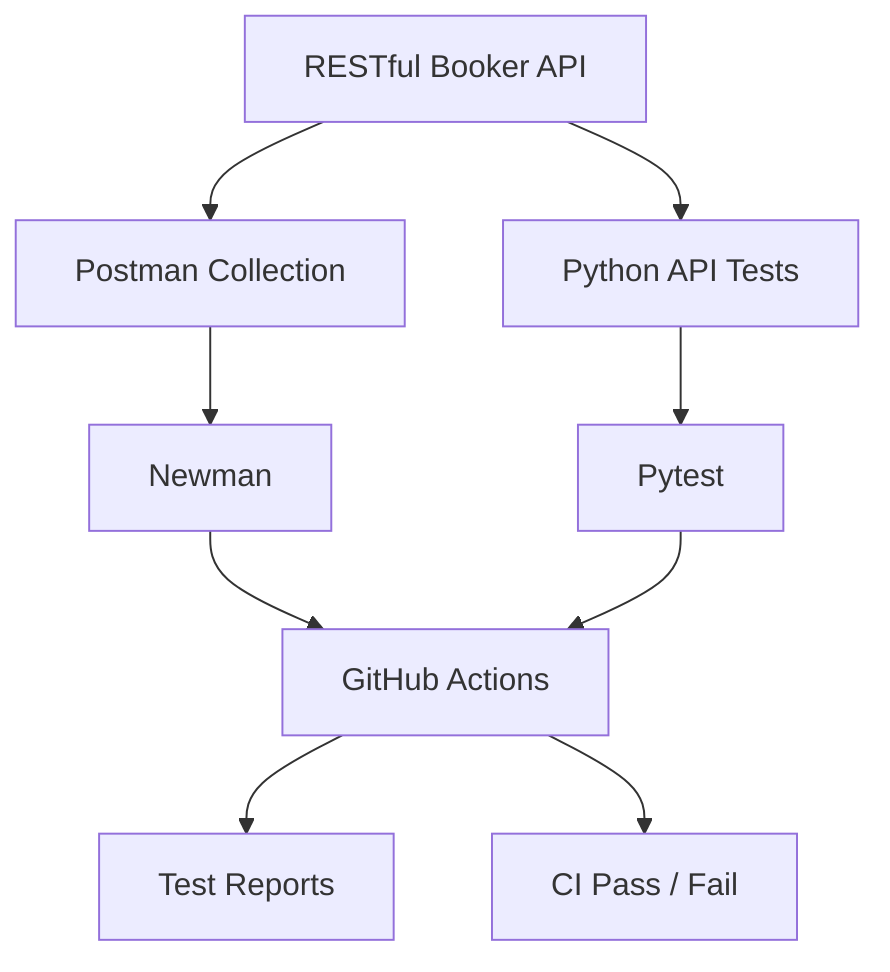

# Architecture (placeholder — diagrams: Phase 25)

> Status: skeleton created in Phase 0.

Planned:

Repository separation: `docs/` (documentation), `postman/` (collections,
environments, schemas), `tests/` + `src/` (Python automation), `.github/`
(CI), `reports/` (generated artifacts, git-ignored except `.gitkeep`).
