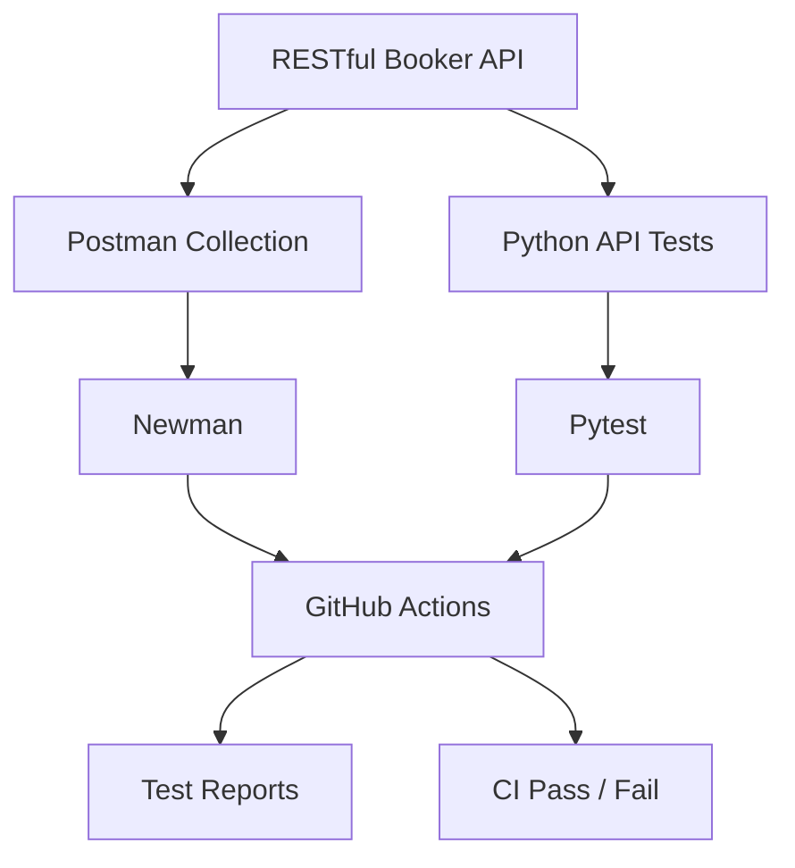
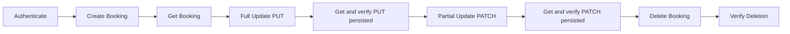
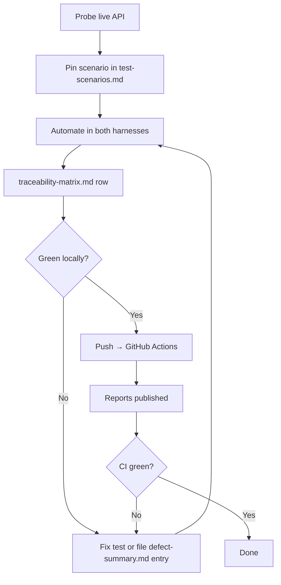

# Architecture (Phase 25)

> Renders on GitHub (Mermaid). Text below each diagram states what the
> arrows mean, so the design survives even where Mermaid doesn't render.

## 1. System — two harnesses, one gate

Reading: the API under test sits left. Two independent harnesses exercise
it — the Postman collection (run by Newman) and the pytest suite — so a
green build means two different HTTP stacks agree on the contract. Both feed
the same gate: GitHub Actions (`api-tests.yml`, `postman-tests.yml`), which
publishes JUnit + HTML reports and fails the run on any test, install, or
artifact failure. One contract (`postman/schemas/` ⇄ `tests/schemas/`,
byte-identical copies) is asserted in both harnesses, so contract drift
breaks both sides loudly.

## 2. Booking lifecycle — the stateful spine

Reading: the only intentionally stateful flow in the project
(`E2E-001` token, `E2E-002` Basic — Postman folder 08, GET verifies the
persisted state after both PUT and PATCH, and every hop is asserted).
pytest covers the same spine hop-by-hop with independent tests
(create → round-trip, put-persist, patch-persist, delete + verify-gone) so
no pytest test depends on execution order (Rule 8); the statefulness lives
in exactly one place per harness. No booking ID is ever hardcoded — runtime
IDs flow through `bookingId` (Postman) / `created_booking` (pytest).

## 3. Test workflow — from probe to gate

Reading: this is the process contract (Rules 1–3). Behavior is probed
before it is asserted; scenarios freeze before automation references them;
every automation row traces end to end; failures route to either a test fix
or a defect entry — never to a weakened assertion.

## 4. Components and boundaries

| Component | Path | Owns | Must not |
| --- | --- | --- | --- |
| API client | `src/api_client.py` | Base URL, JSON headers, timeout, HTTP verbs, `auth_headers()` cookie helper | Carry credentials on the shared session (keeps unauthenticated tests honest) |
| Config | `src/config.py` | Env-var resolution with demo defaults | Contain secrets (only `.env.example` defaults, git-ignored `.env`) |
| Test data | `src/test_data.py` | Unique valid payloads, invalid/boundary variants, auth payloads | Hardcode booking IDs |
| Fixtures | `tests/conftest.py` | `api_client`, `auth_token` (session), `valid_booking_payload`, `created_booking` (function, best-effort cleanup) | Global mutable state |
| Schema helper | `tests/schema_validation.py` | Draft-7 validation with `<path>: <message>` failures, local `$ref` | Loose schemas (strict required/type/nesting) |
| Contracts | `postman/schemas/`, `tests/schemas/` | 4 byte-identical contracts (auth, booking, booking-response, booking-list) | Drift (copies compared when touched) |
| Collection | `postman/collections/` + `environments/` | 61 requests / 8 folders, chaining via dual-scope variables | Hardcoded IDs (only intentional negative probes) |
| CI | `.github/workflows/` | Fail-closed gates, JUnit + HTML artifacts | `continue-on-error` (only uploads use `if: always()`) |
| Docs | `docs/` | Strategy → scenarios → automation → defects → traceability → evidence | Fabricated numbers (all counts observed) |

Separation rule: `docs/` explains, `postman/` + `tests/` prove, `.github/`
gates, `reports/` shows. Generated artifacts never enter git (`reports/` is
git-ignored); committed evidence (`docs/evidence/`) is verbatim transcripts,
not outputs pretending to be inputs.
