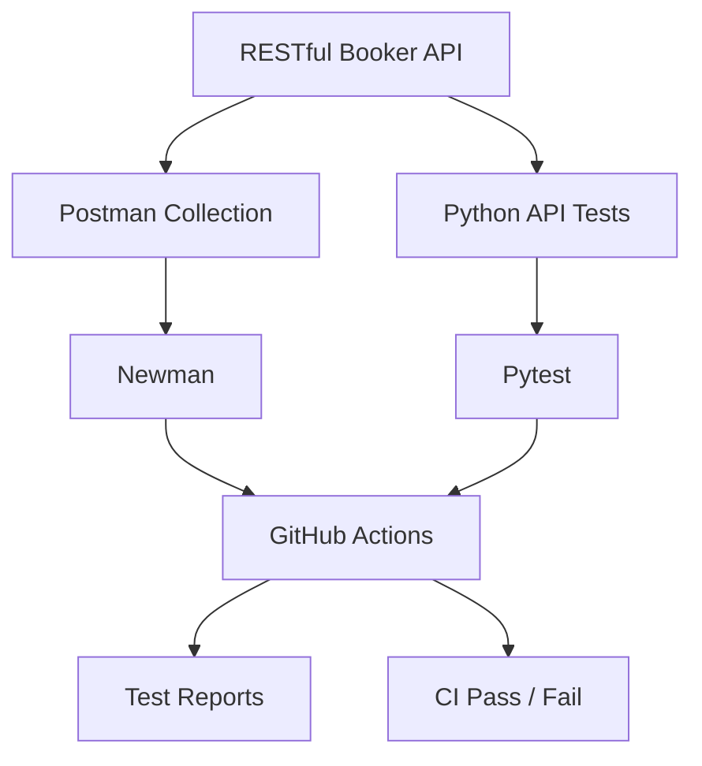
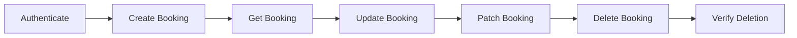

# API Testing Portfolio Project — Production-Quality Implementation Plan

## 1. Project Overview

### Project Name

**Production-Grade API Testing Framework — RESTful Booker**

### Objective

Build a professional API testing project against the public **RESTful Booker API** that demonstrates practical QA engineering skills across:

* API functional testing
* CRUD testing
* Authentication testing
* Positive and negative testing
* Boundary and validation testing
* JSON schema validation
* Response contract validation
* Data-driven testing
* Postman collection development
* Newman CLI execution
* Automated test execution in CI/CD
* Python API automation with `pytest` + `requests`
* Test reporting
* Test organization and maintainability
* Defect-oriented thinking
* Professional documentation

The final repository should look like a **real API QA automation project that could be presented to a software company or freelance client**, rather than a tutorial or student exercise.

---

# 2. Recommended Technology Stack

Use the following stack unless a technical limitation requires a justified alternative.

### Primary API Testing

* Postman
* Newman
* JavaScript/Postman test scripts
* JSON Schema validation

### Code-Based Automation

* Python 3.12+
* pytest
* requests
* jsonschema
* pytest-html or Allure-compatible reporting where practical

### CI/CD

* GitHub Actions
* Newman CLI
* pytest
* Automated test execution on:

  * push
  * pull request
  * manual workflow dispatch

### Documentation

* Markdown
* Mermaid diagrams where useful
* Clear screenshots/examples

### Repository

Use a professional GitHub repository structure.

---

# 3. API Under Test

Use:

**RESTful Booker**

The project should use the publicly available RESTful Booker API and its documented endpoints.

Primary API areas to cover:

* Health check
* Authentication
* Booking creation
* Booking retrieval
* Booking update
* Booking partial update
* Booking deletion
* Booking listing/filtering

Do not blindly assume every endpoint behaves perfectly.

A major goal of the project is to demonstrate the ability to test **real API behavior**, including unexpected responses and edge cases.

---

# 4. Core QA Strategy

The testing strategy should cover the following categories.

## Functional Testing

Verify that each supported API operation behaves according to its expected contract.

Examples:

* Create booking
* Retrieve booking
* Update booking
* Partial update
* Delete booking
* Retrieve booking list
* Authentication

## Positive Testing

Verify valid requests and expected successful responses.

## Negative Testing

Verify invalid requests and malformed data.

Examples:

* Missing required fields
* Invalid authentication
* Invalid booking ID
* Invalid data types
* Empty values
* Unsupported values
* Malformed JSON
* Missing headers
* Invalid dates
* Invalid credentials

## Boundary Testing

Test values near logical boundaries.

Examples:

* Empty strings
* Very long strings
* Minimum/maximum reasonable values
* Zero values
* Negative values
* Large booking IDs

## Contract Testing

Validate:

* HTTP status codes
* Required response fields
* Field types
* Response structure
* Headers
* Content type
* JSON schema

## Authentication Testing

Cover:

* Valid credentials
* Invalid credentials
* Missing credentials
* Token creation
* Authenticated requests
* Invalid/expired token behavior where supported

## Data Integrity Testing

Verify that data sent to the API is correctly returned after creation/update.

Example:

```text
POST booking
      ↓
Capture booking ID
      ↓
GET booking
      ↓
Compare request vs response
```

---

# 5. Project Architecture

Use a clean repository structure similar to:

```text
api-testing-portfolio/
│
├── README.md
│
├── docs/
│   ├── test-strategy.md
│   ├── test-plan.md
│   ├── test-scenarios.md
│   ├── test-data.md
│   ├── defect-summary.md
│   └── architecture.md
│
├── postman/
│   ├── collections/
│   │   └── restful-booker-api.postman_collection.json
│   │
│   ├── environments/
│   │   └── restful-booker.postman_environment.json
│   │
│   └── schemas/
│       ├── booking-schema.json
│       ├── booking-response-schema.json
│       └── auth-schema.json
│
├── tests/
│   ├── api/
│   │   ├── test_health.py
│   │   ├── test_auth.py
│   │   ├── test_booking_create.py
│   │   ├── test_booking_get.py
│   │   ├── test_booking_update.py
│   │   ├── test_booking_delete.py
│   │   └── test_booking_negative.py
│   │
│   ├── schemas/
│   │   ├── booking_schema.json
│   │   └── auth_schema.json
│   │
│   └── conftest.py
│
├── src/
│   ├── api_client.py
│   ├── config.py
│   └── test_data.py
│
├── reports/
│   └── .gitkeep
│
├── scripts/
│   ├── run_postman.sh
│   └── run_tests.sh
│
├── .github/
│   └── workflows/
│       ├── api-tests.yml
│       └── postman-tests.yml
│
├── requirements.txt
├── pytest.ini
├── .gitignore
├── .env.example
└── LICENSE
```

Adapt the structure if necessary, but preserve the separation between:

* documentation
* Postman artifacts
* Python automation
* schemas
* CI
* configuration
* reports

---

# PHASE 0 — Project Initialization

## Goal

Create the professional repository foundation before implementing tests.

## Tasks

1. Initialize the repository.
2. Create the directory structure.
3. Add `.gitignore`.
4. Add `README.md`.
5. Add `requirements.txt`.
6. Add `pytest.ini`.
7. Add `.env.example`.
8. Configure Python virtual environment instructions.
9. Add GitHub Actions directory.
10. Add initial documentation structure.

## Quality Requirements

The repository must:

* contain no secrets
* contain no hardcoded credentials
* use environment variables for configurable values
* have clear setup instructions
* be runnable by another developer

## Deliverable

A clean repository skeleton ready for implementation.

---

# PHASE 1 — API Reconnaissance

## Goal

Understand the API before writing tests.

## Tasks

Analyze the RESTful Booker API documentation and identify:

* Base URL
* Available endpoints
* HTTP methods
* Authentication mechanism
* Required headers
* Request body structures
* Response structures
* Expected status codes
* Supported query parameters
* Known API limitations
* Potential failure conditions

Create:

```text
docs/api-inventory.md
```

Include a table:

| Endpoint        | Method | Purpose         | Auth | Expected Status |
| --------------- | ------ | --------------- | ---- | --------------- |
| `/ping`         | GET    | Health check    | No   | 200             |
| `/auth`         | POST   | Generate token  | No   | 200             |
| `/booking`      | POST   | Create booking  | No   | 200             |
| `/booking/{id}` | GET    | Get booking     | No   | 200             |
| `/booking/{id}` | PUT    | Replace booking | Yes  | 200             |
| `/booking/{id}` | PATCH  | Update booking  | Yes  | 200             |
| `/booking/{id}` | DELETE | Delete booking  | Yes  | 201             |

Verify the actual API behavior rather than assuming the documentation is always accurate.

---

# PHASE 2 — Test Strategy and Test Plan

## Goal

Create professional QA documentation before automation.

Create:

```text
docs/test-strategy.md
docs/test-plan.md
docs/test-scenarios.md
```

## Test Strategy

Document:

* Scope
* Out of scope
* Test objectives
* Test levels
* Test types
* Test approach
* Environment
* Tools
* Risk areas
* Entry criteria
* Exit criteria
* Defect strategy
* Automation strategy

## Test Plan

Define testing for:

### Functional Areas

1. Health check
2. Authentication
3. Booking creation
4. Booking retrieval
5. Booking update
6. Booking deletion
7. Filtering
8. Negative behavior
9. Response validation
10. Data integrity

### Test Types

* Smoke
* Functional
* Regression
* Negative
* Boundary
* Contract/schema
* Authentication
* Integration-style workflow tests

---

# PHASE 3 — Test Scenario Design

Create a professional scenario matrix.

Example:

| ID       | Area           | Scenario                              | Type     | Priority |
| -------- | -------------- | ------------------------------------- | -------- | -------- |
| AUTH-001 | Authentication | Authenticate with valid credentials   | Positive | P0       |
| AUTH-002 | Authentication | Authenticate with invalid credentials | Negative | P1       |
| BOOK-001 | Create         | Create booking with valid payload     | Positive | P0       |
| BOOK-002 | Create         | Create booking without first name     | Negative | P1       |
| BOOK-003 | Create         | Create booking with invalid date      | Negative | P1       |
| BOOK-004 | Get            | Retrieve existing booking             | Positive | P0       |
| BOOK-005 | Get            | Retrieve nonexistent booking          | Negative | P1       |
| BOOK-006 | Update         | Update booking with valid token       | Positive | P0       |
| BOOK-007 | Update         | Update booking without authentication | Negative | P1       |
| BOOK-008 | Delete         | Delete existing booking               | Positive | P0       |

Target:

**40–60 meaningful API test scenarios.**

Do not inflate the count with meaningless variations.

---

# PHASE 4 — Test Data Strategy

Create reusable test data.

Include:

### Valid Data

* Standard booking
* Different names
* Different dates
* Different prices
* Deposit true/false
* Additional needs

### Invalid Data

* Missing fields
* Empty strings
* Invalid data types
* Invalid dates
* Negative price
* Extremely large price
* Invalid boolean values
* Malformed payloads

### Authentication Data

Store credentials through environment variables where possible.

Never commit real secrets.

Create:

```text
docs/test-data.md
```

Document how test data is generated and managed.

---

# PHASE 5 — Postman Collection

## Goal

Create a polished Postman collection that could be delivered to a client.

Collection:

```text
postman/collections/restful-booker-api.postman_collection.json
```

Organize requests into folders:

```text
RESTful Booker API
│
├── 01 - Health
├── 02 - Authentication
├── 03 - Booking - Create
├── 04 - Booking - Read
├── 05 - Booking - Update
├── 06 - Booking - Delete
├── 07 - Negative Tests
└── 08 - End-to-End Workflows
```

Each request must contain:

* Clear name
* Description
* HTTP method
* URL
* Required headers
* Request body where applicable
* Tests
* Variables
* Appropriate assertions

---

# PHASE 6 — Postman Assertions

Every important request should contain meaningful assertions.

Validate:

### HTTP Status

Examples:

```javascript
pm.response.to.have.status(200);
```

### Response Time

Add reasonable performance assertions where appropriate.

Example:

```javascript
pm.expect(pm.response.responseTime).to.be.below(2000);
```

Do not make arbitrary performance claims. Clearly document that these are lightweight client-side thresholds rather than formal performance SLAs.

### Content Type

Validate JSON responses.

### Required Fields

Verify expected fields exist.

### Data Types

Validate:

* strings
* numbers
* booleans
* objects
* arrays

### Response Values

Verify returned values against expected/requested values.

---

# PHASE 7 — JSON Schema Validation

Implement JSON schema validation for important responses.

Schemas should cover:

### Authentication

```text
auth-schema.json
```

### Booking

```text
booking-schema.json
```

### Booking Creation Response

Validate:

```text
bookingid
booking
```

### Booking List

Validate array/object structure as appropriate.

Use Postman's schema validation capabilities or equivalent JavaScript validation logic.

The schema should verify:

* required properties
* property types
* nested objects
* arrays
* nullable/optional fields where applicable

Avoid schemas that are so loose that they provide no meaningful protection.

---

# PHASE 8 — Dynamic Variables and Chained Workflows

Demonstrate realistic API automation.

Example workflow:

```text
Authenticate
    ↓
Store token
    ↓
Create booking
    ↓
Store booking ID
    ↓
Retrieve booking
    ↓
Validate booking
    ↓
Update booking
    ↓
Retrieve booking again
    ↓
Validate update
    ↓
Delete booking
    ↓
Verify deletion
```

Use Postman environment/collection variables.

Examples:

```text
baseUrl
token
bookingId
firstName
lastName
```

Do not hardcode dynamically generated IDs.

---

# PHASE 9 — Negative Testing

Build a dedicated negative-testing section.

Include meaningful scenarios such as:

## Authentication

* Invalid username
* Invalid password
* Missing credentials
* Empty credentials

## Booking

* Missing required fields
* Invalid field types
* Empty strings
* Invalid dates
* Invalid booking ID
* Nonexistent booking
* Missing authentication
* Invalid authentication token

## Request-Level Validation

* Missing Content-Type
* Invalid Content-Type
* Malformed JSON
* Unexpected fields

For each negative test:

1. Send intentionally invalid request.
2. Capture response.
3. Validate actual behavior.
4. Compare behavior with expected behavior.
5. Document discrepancies.

Important:

**Do not automatically mark an unexpected API behavior as a test failure without understanding whether the API contract actually defines that behavior.**

---

# PHASE 10 — End-to-End Business Workflow

Create at least one realistic workflow.

Example:

## Booking Lifecycle

```text
Authenticate
      ↓
Create booking
      ↓
Capture booking ID
      ↓
GET booking
      ↓
Verify created data
      ↓
PUT booking
      ↓
GET booking
      ↓
Verify updated data
      ↓
PATCH booking
      ↓
Verify partial update
      ↓
DELETE booking
      ↓
Verify booking is no longer accessible
```

This should demonstrate understanding of API state and dependencies rather than isolated endpoint testing.

---

# PHASE 11 — Newman Integration

Install Newman.

Provide an npm-based or documented CLI execution path.

Example:

```bash
newman run postman/collections/restful-booker-api.postman_collection.json
```

Add environment support.

Example:

```bash
newman run collection.json \
  -e environment.json
```

Generate a useful report.

Potential formats:

* CLI
* HTML
* JUnit XML

Prefer JUnit XML for CI integration.

Document:

```text
docs/newman.md
```

---

# PHASE 12 — Python API Automation

## Goal

Reimplement important API checks using Python.

Use:

* `pytest`
* `requests`
* `jsonschema`

Create a maintainable API client abstraction.

Example conceptual structure:

```text
tests/
    api/
        test_auth.py
        test_booking_create.py
        test_booking_get.py
        test_booking_update.py
        test_booking_delete.py
        test_booking_negative.py

src/
    api_client.py
```

Avoid writing the entire project as one huge test file.

---

# PHASE 13 — Python API Client

Implement reusable request methods.

Conceptually:

```python
class ApiClient:
    def get(...)
    def post(...)
    def put(...)
    def patch(...)
    def delete(...)
```

Centralize:

* base URL
* headers
* authentication
* timeout
* request handling

Do not over-engineer the framework.

The goal is to demonstrate professional maintainability, not framework complexity.

---

# PHASE 14 — Pytest Fixtures

Use fixtures for reusable setup.

Examples:

```text
api_client
auth_token
created_booking
valid_booking_payload
```

Use fixture scopes carefully.

Avoid unnecessary global state.

Ensure tests can run independently wherever practical.

---

# PHASE 15 — Python Schema Validation

Use `jsonschema`.

Validate important responses against the same conceptual contracts used in Postman.

Example:

```text
tests/schemas/
    booking_schema.json
    auth_schema.json
```

Tests should fail clearly when the response violates the schema.

Error messages should help identify:

* missing property
* incorrect type
* invalid structure

---

# PHASE 16 — Data-Driven Testing

Use parameterization where it adds value.

Example:

```python
@pytest.mark.parametrize(
    "username,password",
    [
        ("invalid-user", "invalid-password"),
        ("admin", "wrong-password"),
        ("", ""),
    ],
)
def test_invalid_authentication(username, password):
    ...
```

Use this approach for related negative scenarios rather than duplicating test functions.

---

# PHASE 17 — Configuration Management

Use environment variables.

Example:

```text
API_BASE_URL
API_USERNAME
API_PASSWORD
API_TIMEOUT
```

Create:

```text
.env.example
```

Example:

```text
API_BASE_URL=https://example.com
API_USERNAME=
API_PASSWORD=
API_TIMEOUT=10
```

Never commit:

```text
.env
```

or real credentials.

---

# PHASE 18 — CI/CD with GitHub Actions

Create:

```text
.github/workflows/api-tests.yml
.github/workflows/postman-tests.yml
```

CI should:

1. Checkout repository
2. Install dependencies
3. Validate project structure
4. Run pytest
5. Run Newman
6. Generate test reports
7. Upload useful artifacts
8. Fail the workflow when tests fail

Run automatically on:

```text
push
pull_request
workflow_dispatch
```

Use a matrix only if it provides meaningful coverage.

Do not add unnecessary complexity.

---

# PHASE 19 — CI Quality Gates

The pipeline must fail when:

* pytest tests fail
* Newman tests fail
* schema validation fails
* required dependencies cannot be installed
* collection execution fails

The CI workflow should produce clear logs.

Where practical, publish JUnit-compatible results.

Example conceptual pipeline:

```text
Git Push / Pull Request
        ↓
GitHub Actions
        ↓
Install Python dependencies
        ↓
Run pytest
        ↓
Run Newman
        ↓
Generate reports
        ↓
Upload artifacts
        ↓
PASS / FAIL
```

---

# PHASE 20 — Test Reporting

Create useful reports rather than merely dumping console output.

Reports should communicate:

* Total tests
* Passed
* Failed
* Skipped
* Duration
* Failed test names
* Failure reasons

If HTML reporting is used, ensure it is generated automatically.

CI artifacts should be easy to retrieve.

---

# PHASE 21 — Defect-Oriented Analysis

Treat unexpected API behavior as potential defects.

Create:

```text
docs/defect-summary.md
```

For each confirmed defect or API-contract discrepancy, document:

```text
Defect ID
Title
Severity
Priority
Environment
Endpoint
Method
Preconditions
Steps to reproduce
Request
Expected result
Actual result
Evidence
Impact
Status
```

Do not invent defects merely to make the portfolio look impressive.

If no genuine defects are found, document that honestly and include examples of **potential risk areas** instead.

---

# PHASE 22 — Traceability Matrix

Create:

```text
docs/traceability-matrix.md
```

Map:

```text
Requirement
   ↓
Test Scenario
   ↓
Postman Test
   ↓
Python Test
   ↓
CI Execution
```

Example:

| Requirement               | Scenario | Postman  | Pytest              | Priority |
| ------------------------- | -------- | -------- | ------------------- | -------- |
| User can create booking   | BOOK-001 | POST-001 | test_create_booking | P0       |
| User can retrieve booking | BOOK-002 | GET-001  | test_get_booking    | P0       |
| Invalid auth rejected     | AUTH-002 | AUTH-002 | test_invalid_auth   | P1       |

This makes the project look significantly more professional.

---

# PHASE 23 — README Development

The README is one of the most important portfolio assets.

It should immediately communicate:

### Project

**Production-Grade REST API Testing Framework**

### Technologies

```text
Postman
Newman
Python
Pytest
Requests
JSON Schema
GitHub Actions
```

### What Was Tested

* Authentication
* CRUD operations
* Negative cases
* Schema validation
* Data integrity
* End-to-end workflows

### Automation

Explain:

```text
Postman → Newman → CI
Python → Pytest → CI
```

### Repository Structure

Show the major directories.

### How to Run

Provide exact commands.

### CI

Show GitHub Actions status badge if available.

### Test Coverage

Provide meaningful numbers only after actual implementation.

For example:

```text
API endpoints covered: X
Postman test cases: X
Python test cases: X
Negative scenarios: X
Schemas validated: X
```

Never invent these numbers.

---

# PHASE 24 — Portfolio Presentation

Make the repository visually professional.

Include:

* CI status badge
* Technology badges where appropriate
* Architecture diagram
* Test workflow diagram
* Example test report screenshots
* Example Postman collection screenshot
* Example CI run screenshot
* Example API request/response
* Example schema validation
* Example defect report

Do not overload the README with decorative badges.

Prioritize evidence over decoration.

---

# PHASE 25 — Architecture Diagram

Create a Mermaid diagram similar to:



Add a second diagram showing the booking lifecycle:



---

# PHASE 26 — Test Quality Review

Before considering the project complete, perform a QA review.

Check:

### Test Quality

* Are tests independent?
* Are assertions meaningful?
* Are negative cases useful?
* Are edge cases included?
* Are status codes validated?
* Are response bodies validated?
* Are schemas meaningful?

### Code Quality

* Is code readable?
* Is duplication minimized?
* Are fixtures appropriate?
* Are functions small and focused?
* Are configuration values externalized?
* Are exceptions handled sensibly?

### Repository Quality

* Is the README complete?
* Is setup reproducible?
* Are secrets excluded?
* Are reports understandable?
* Is the folder structure logical?

### CI Quality

* Does CI work from a clean environment?
* Does failure correctly fail the workflow?
* Are artifacts uploaded?
* Can another developer reproduce failures?

---

# PHASE 27 — Failure Simulation

Intentionally introduce a small controlled test failure during development.

Verify that:

```text
Test failure
    ↓
pytest/Newman failure
    ↓
non-zero exit code
    ↓
GitHub Actions failure
```

Then restore the correct implementation.

This confirms that the CI pipeline is actually enforcing quality gates.

Document this only if useful to demonstrate CI behavior.

---

# PHASE 28 — Final Portfolio Audit

Perform a final audit from the perspective of a recruiter or freelance client.

Ask:

### Can a recruiter understand the project in 30 seconds?

### Can a developer clone and run it?

### Does the project demonstrate actual testing skill?

### Are the tests meaningful?

### Is there evidence of negative testing?

### Is schema validation implemented?

### Is authentication handled?

### Is there CI automation?

### Is the project reproducible?

### Does the README demonstrate business value?

### Does the repository look maintained?

Fix anything that makes the project look like a tutorial or classroom assignment.

---

# PHASE 29 — Final Deliverables

The completed repository should contain at minimum:

## Documentation

```text
README.md
docs/api-inventory.md
docs/test-strategy.md
docs/test-plan.md
docs/test-scenarios.md
docs/test-data.md
docs/traceability-matrix.md
docs/defect-summary.md
```

## Postman

```text
postman/collections/restful-booker-api.postman_collection.json
postman/environments/restful-booker.postman_environment.json
postman/schemas/*.json
```

## Python

```text
src/api_client.py
tests/api/*.py
tests/schemas/*.json
tests/conftest.py
```

## CI

```text
.github/workflows/api-tests.yml
.github/workflows/postman-tests.yml
```

## Configuration

```text
requirements.txt
pytest.ini
.env.example
.gitignore
```

---

# PHASE 30 — Definition of Done

The project is complete only when all of the following are true.

## API Coverage

* [ ] Health endpoint tested
* [ ] Authentication tested
* [ ] Create booking tested
* [ ] Retrieve booking tested
* [ ] Update booking tested
* [ ] Partial update tested
* [ ] Delete booking tested
* [ ] Booking listing/filtering tested where applicable

## Functional Testing

* [ ] Positive cases implemented
* [ ] Negative cases implemented
* [ ] Boundary cases implemented
* [ ] Data integrity verified
* [ ] End-to-end workflow implemented

## Validation

* [ ] Status codes validated
* [ ] Headers validated
* [ ] Response content validated
* [ ] JSON schema validation implemented
* [ ] Data types validated
* [ ] Required properties validated

## Postman

* [ ] Professional collection structure
* [ ] Environment variables
* [ ] Dynamic variables
* [ ] Request chaining
* [ ] Assertions
* [ ] Negative tests
* [ ] Schema validation

## Newman

* [ ] Collection runs from CLI
* [ ] Environment supported
* [ ] CI-compatible exit codes
* [ ] Reports generated

## Python

* [ ] pytest implemented
* [ ] requests implemented
* [ ] reusable API client
* [ ] fixtures
* [ ] parameterized tests
* [ ] schema validation
* [ ] negative tests

## CI/CD

* [ ] GitHub Actions configured
* [ ] pytest runs automatically
* [ ] Newman runs automatically
* [ ] failures fail CI
* [ ] reports/artifacts available

## Documentation

* [ ] Test strategy
* [ ] Test plan
* [ ] Test scenarios
* [ ] API inventory
* [ ] Test data strategy
* [ ] Traceability matrix
* [ ] Defect analysis
* [ ] README

## Portfolio Quality

* [ ] Professional repository structure
* [ ] Clear README
* [ ] Architecture diagram
* [ ] CI badge
* [ ] Evidence/screenshots
* [ ] No secrets
* [ ] No fake defects
* [ ] No fabricated metrics
* [ ] Reproducible setup

---

# Implementation Rules for Codex

## Rule 1 — Work Phase-by-Phase

Do not attempt to generate the entire project blindly in one operation.

Implement:

```text
Phase
↓
Run/validate
↓
Fix issues
↓
Commit-quality state
↓
Next phase
```

---

## Rule 2 — Verify the API

Do not assume the public API behaves exactly as its documentation says.

Whenever possible:

1. Inspect documentation.
2. Execute the request.
3. Observe the real response.
4. Build assertions based on the actual contract.
5. Document inconsistencies.

---

## Rule 3 — Never Fake Results

Never fabricate:

* passing tests
* bugs
* coverage numbers
* CI results
* screenshots
* performance numbers
* API behavior

Only document results that were actually observed.

---

## Rule 4 — Keep Secrets Out of Git

Never commit:

```text
.env
API credentials
tokens
private keys
personal access tokens
```

Use:

```text
.env.example
```

and GitHub Actions secrets where required.

---

## Rule 5 — Prefer Maintainability

Do not create unnecessarily complicated frameworks.

A smaller, readable automation framework is preferable to hundreds of lines of abstraction that do not provide value.

---

## Rule 6 — Tests Must Fail for the Right Reasons

Avoid weak assertions such as:

```python
assert response.status_code
```

Prefer:

```python
assert response.status_code == 200
```

Avoid assertions that only prove that a response exists.

Every test should validate an actual requirement or risk.

---

## Rule 7 — Use Clear Naming

Use names that explain the behavior.

Bad:

```text
test_1
test_api
test_booking
```

Good:

```text
test_create_booking_returns_booking_id
test_get_nonexistent_booking_returns_expected_error
test_update_booking_requires_authentication
test_create_booking_response_matches_schema
```

---

## Rule 8 — Keep Tests Independent

Tests should not depend on execution order unless the workflow intentionally represents a stateful business flow.

Use fixtures and setup/teardown appropriately.

---

## Rule 9 — Do Not Hide Failures

Do not catch exceptions merely to make CI pass.

A failing test should produce a useful failure.

---

## Rule 10 — Produce Portfolio-Ready Evidence

At the end of implementation, identify the strongest evidence to showcase:

1. Postman collection
2. Newman CLI execution
3. Python pytest results
4. GitHub Actions successful run
5. Negative test example
6. Schema validation example
7. End-to-end workflow
8. Professional documentation
9. Traceability matrix
10. Defect report if a genuine issue was discovered

---

# Recommended Implementation Order

Execute the project in exactly this general sequence:

```text
PHASE 0
Repository Initialization
        ↓
PHASE 1
API Reconnaissance
        ↓
PHASE 2
Test Strategy + Test Plan
        ↓
PHASE 3
Test Scenario Design
        ↓
PHASE 4
Test Data
        ↓
PHASE 5
Postman Collection
        ↓
PHASE 6
Postman Assertions
        ↓
PHASE 7
Schema Validation
        ↓
PHASE 8
Dynamic Variables + Chaining
        ↓
PHASE 9
Negative Testing
        ↓
PHASE 10
End-to-End Workflow
        ↓
PHASE 11
Newman
        ↓
PHASE 12
Python Automation
        ↓
PHASE 13
API Client
        ↓
PHASE 14
Pytest Fixtures
        ↓
PHASE 15
Python Schema Validation
        ↓
PHASE 16
Data-Driven Testing
        ↓
PHASE 17
Configuration
        ↓
PHASE 18
GitHub Actions
        ↓
PHASE 19
CI Quality Gates
        ↓
PHASE 20
Reporting
        ↓
PHASE 21
Defect Analysis
        ↓
PHASE 22
Traceability
        ↓
PHASE 23
README
        ↓
PHASE 24
Portfolio Presentation
        ↓
PHASE 25
Architecture Diagrams
        ↓
PHASE 26
Quality Review
        ↓
PHASE 27
Failure Simulation
        ↓
PHASE 28
Portfolio Audit
        ↓
PHASE 29
Final Deliverables
        ↓
PHASE 30
Definition of Done
```

---

# Final Objective

The final repository should communicate the following to a recruiter or client:

> **"This person understands API testing as a professional QA activity, can design meaningful test coverage, automate tests using industry-standard tools, validate API contracts, test negative scenarios, build maintainable automation, integrate tests into CI/CD, investigate failures, and document their work professionally."**

The project should therefore prioritize **quality of testing and evidence of engineering judgment over the number of files or lines of code.**
